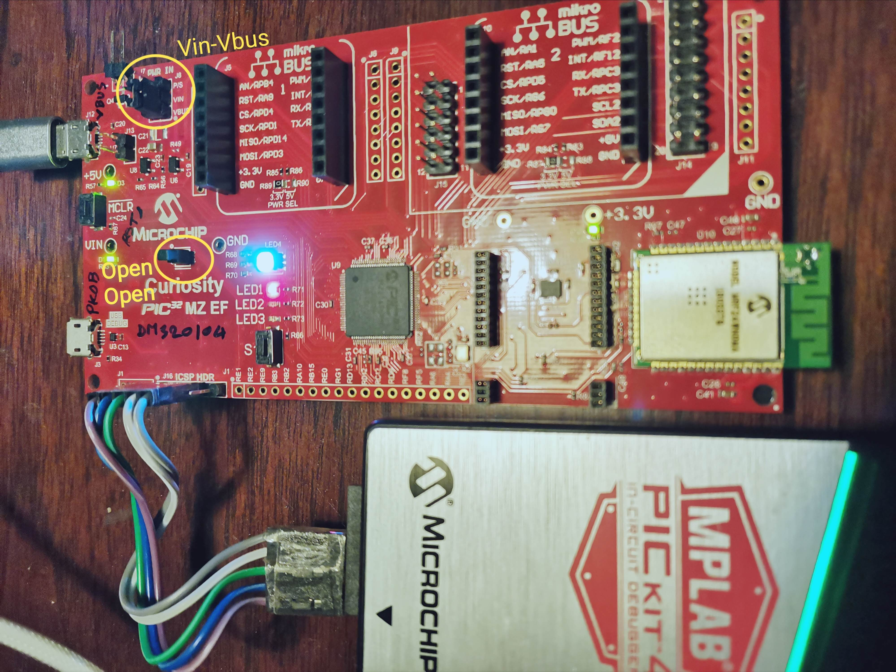
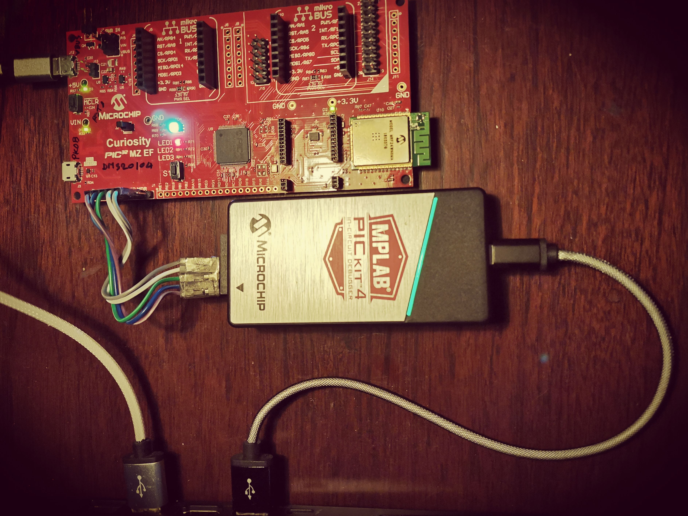

# Example of NETPIE2020 over WiFi (MRF24WN), on Curiosity PIC32MZ EF Board

With [Harmony v2.06](https://www.microchip.com/mplab/mplab-harmony/mplab-harmony-v2),
    this project demonstrates how to connect the PIC32 based board --
    called [Curiosity](https://www.microchip.com/DevelopmentTools/ProductDetails/PartNO/DM320104) --
    to [NETPIE2020 service](https://netpie.io/),
    through the WiFi module -- [MRF24WN](https://www.microchip.com/wwwproducts/en/MRF24WN0MA).
It adopts the main code from example __tcpip/wifi_easy_configuration__ which is packed
    along with Harmony framework, and, the application code from my [NETPIE for Harmony example](https://github.com/iPAS/netpie2020_microchip_harmony_example).

Please feel free to leave any question OR suggestion, thanks.

## Quick Setup

### Board Configuration

- J8: Vin-Vbus for using Vin from the J12 usb port.
- J2: Open 1-2 & Open 3-4 for using ISCP as programmer instead of PKOB.

### Console and ICSP

Connect J12 (Vbus) console port (white usb cable), and, J1 ICSP port (black one) for programming and debugging.

### WiFi

Use Harmony plugin to config the parameters, such as:
- _Harmony Framework Configuration > Drivers > Wi-Fi > Wi-Fi SSID_
- _Harmony Framework Configuration > Drivers > Wi-Fi > Wi-Fi ... Pass Phrase_

### NETPIE2020

https://github.com/iPAS/netpie2020_microchip_harmony_example#quick-setup